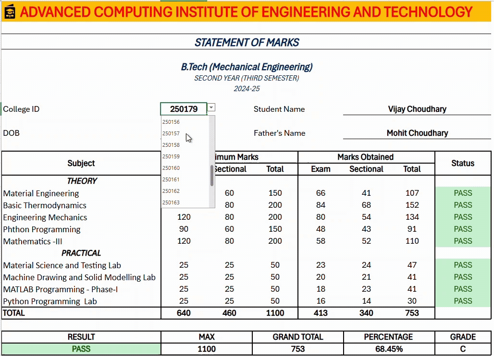
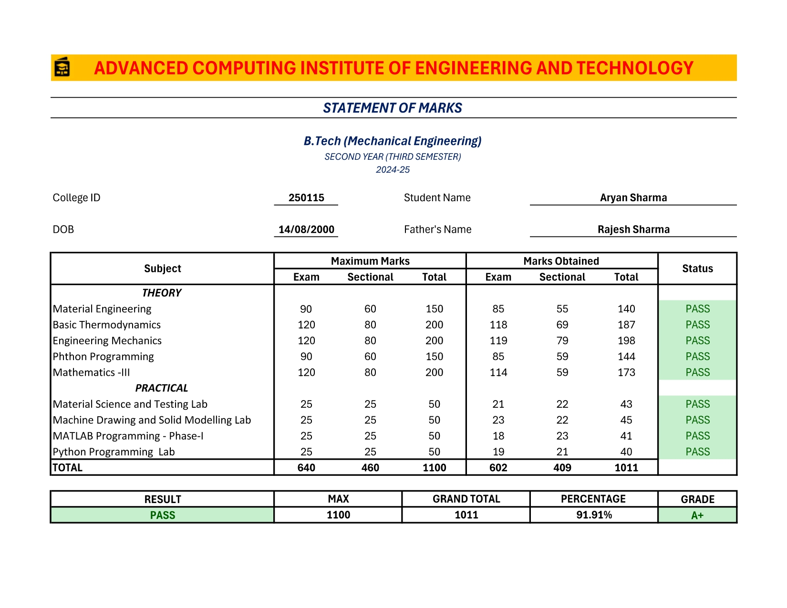
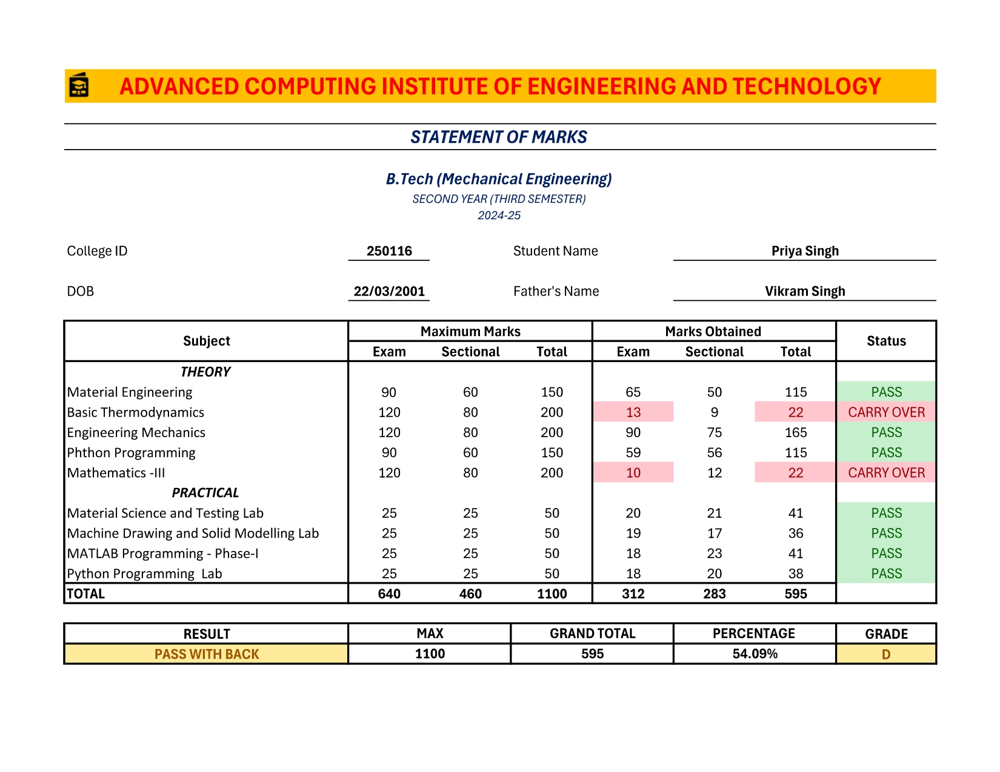
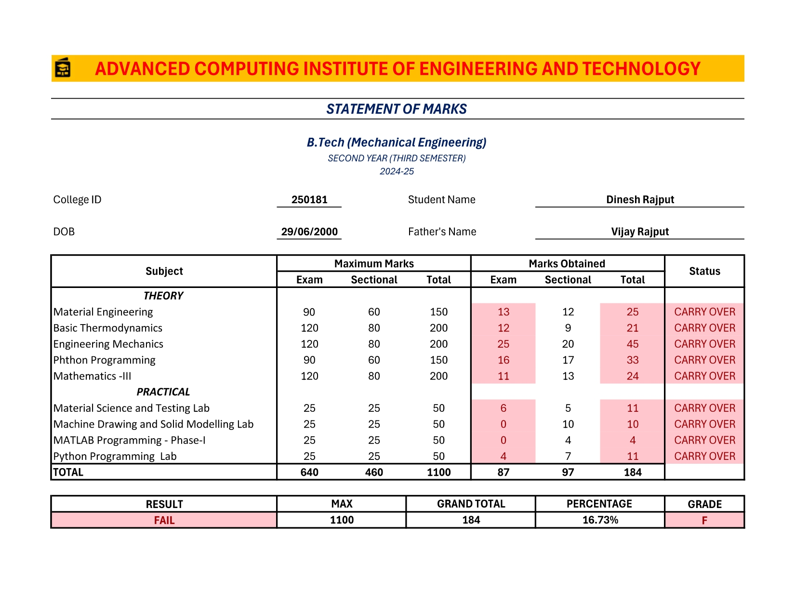

# Student Marksheet Generator

**Live Link:** [Click Here View Report](https://1drv.ms/x/c/cd89ad4bb1755907/EcBVw5KRxY9Hr4CTZvxPP7kBDmzB9eM6GDqv3AIf8zaPxw?e=D8RdD7)






A professional Excel-based student marksheet system for generating academic transcripts and grade reports for engineering students.

## Overview

This project provides a comprehensive Excel template for creating detailed student marksheets with automatic grade calculations, percentage computation, and professional formatting suitable for academic institutions.

## Features

- **Comprehensive Student Information**
  - Student ID and Name
  - Date of Birth
  - Father's Name
  - Course and Semester Details

- **Detailed Subject-wise Breakdown**
  - Theory Subjects with Exam and Sectional marks
  - Practical/Lab subjects
  - Individual subject totals and status (PASS/FAIL)

- **Automatic Calculations**
  - Grand Total
  - Percentage calculation
  - Grade
  - Overall result status


## Getting Started

### Prerequisites
- Microsoft Excel 2024
- Excel Online (for web-based editing)


## Project Structure

```
student-marksheet-generator/
├── README.md
├── marksheet.xlsx
├── samples/
    └── sample-marksheet.gif
    └── sample-marksheet-1.jpg
    └── sample-marksheet-2.jpg
    └── sample-marksheet-3.jpg
```

## Customization

You can customize the marksheet for different:
- Academic programs (B.Tech, M.Tech, BCA, etc.)
- Semesters and years
- Subject lists and credit structures
- Grading systems
- Institutional branding (logo, name, etc.)

## Excel Online Access

View and edit the marksheet online:
- **Excel Online**: Upload to OneDrive and open with Excel Online
- **Office 365**: Access through your institutional Office 365 account

## Contact Me

**Durgesh Nautiyal**
- LinkedIn: [My LinkedIn Profile](https://www.linkedin.com/in/durgesh-nautiyal-95a866223/)
- Email: durgeshnautiyal11@gmail.com
